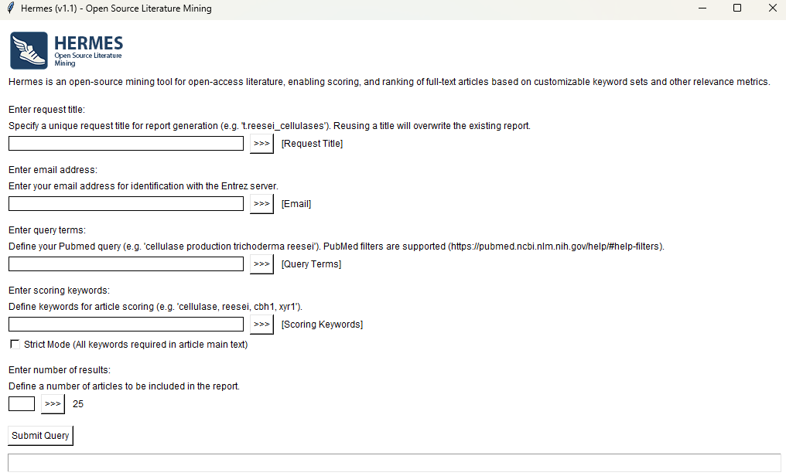

*HERMES* is a python-based, open-source literature mining tool designed to parse full-text, open-access articles from PubMed Central (PMC) and rank them based on:

- TF-IDF–based weighting of user-defined keywords  
- Recency of publication  
- Citation metadata  

Its goal is to facilitate targeted literature discovery and large-scale literature reviews across PubMed Central.

Authors: Julien Charest & Katarina Priselac

Key features:

- Parses complete articles from PubMed Central (Open Access subset)
- Ranks results using a customizable scoring algorithm
- Clean and intuitive GUI (built with Tkinter)
- Summarization of articles using via the Hugging Face Transformers framework and *google/flan-t5-large* large language model
- Biomedical entity extraction (genes, proteins, diseases, chemicals, cells, organisms, tissues, pathways) using SciSpaCy and *en_ner_bionlp13cg_md* model
- Generates reports in PDF format with summary figures
- Supports NCBI API keys for increased request rates
- Exports mining results to CSV for downstream analysis

### Installation 

To install *HERMES*:

```r
# Clone the repository:
git clone https://github.com/julien-charest/hermes.git
cd hermes

# Create conda environment:
conda env create -n hermes -f ./environment.yml

# Activate the environment:
conda activate hermes

# Optional: enable NVIDIA GPU acceleration (Linux/Windows with NVIDIA driver)
conda install pytorch-cuda=11.8 -c pytorch -c nvidia

# Run the application:
python ./hermes.py
```

### Using *HERMES*

To use *HERMES* and generate a PDF report with ranked articles for your query:

- Specify a request title
- Enter your email address (for access to Entrez server)
- Define your Pubmed query (Pubmed filters are supported) (e.g. "ASE asymmetry in C. elegans")
- Enter scoring keywords (e.g. "ASE, lsy-6, che-1")
- Specify if strict mode is desired (all keywords must be included in the main text; powerful to discard article in which keywords are not mentioned together)
- Enter a number of results to be included in final report
- Submit query

